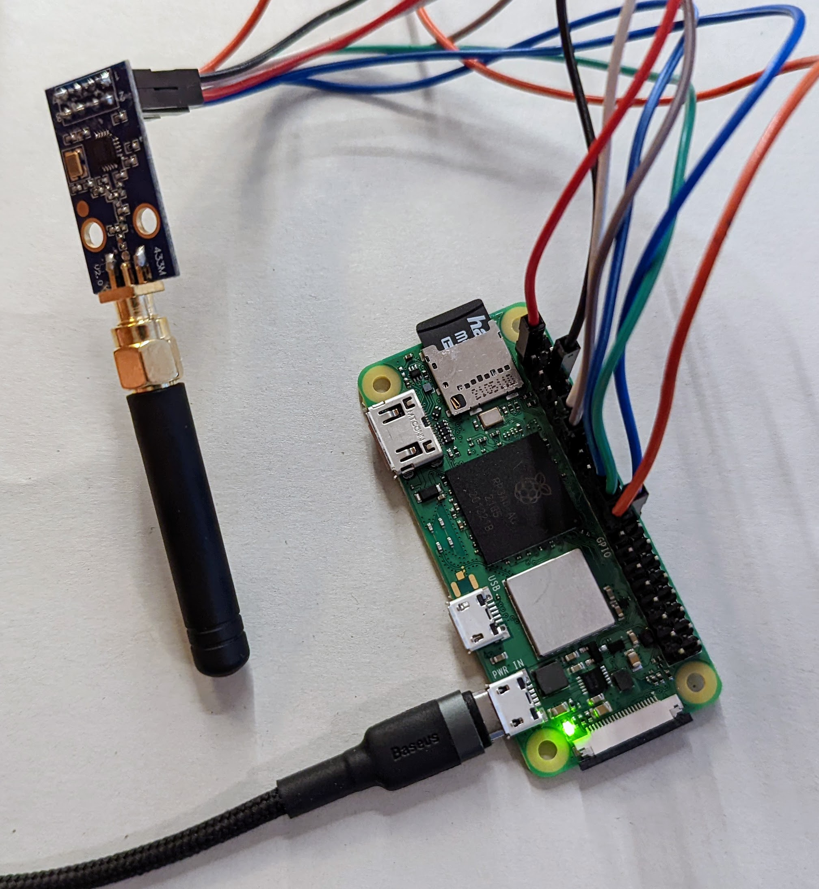

# everblu-meters
Fetch water/gas usage data from Cyble EverBlu meters using RADIAN protocol on 433Mhz.

Meters supported:
- Itron EverBlu Cyble Enhanced

## Hardware

The project runs on Raspberry Pi with an RF transreciver (CC1101). 

### Connections (rpi to CC1101):
- pin 1 (3V3) to pin 2 (VCC)
- pin 6 (GND) to pin 1 (GND)
- pin 11 (GPIO0	) to pin 3 (GDO0)
- pin 24 (CE0) to pin 4 (CSN)
- pin 23 (SCLK) to pin 5 (SCK)
- pin 19 (MOSI) to pin 6 (MOSI)
- pin 21 (MISO) to pin 7 (MISO)
- pin 13 (GPIO27) to pin 8 (GD02)

## Configuration
1. Enable SPI in raspi-config.
2. Install WiringPi from https://github.com/WiringPi/WiringPi/
3. Install libmosquitto-dev: `apt install libmosquitto-dev`
4. Set meter serial number and production date in `cc1101.c`, it can be found on the meter label itself:

5. Compile the code with `make`
6. Run `everblu_meters`, after ~2s your meter data should be on the screen.

## Troubleshooting

### Frequency adjustment
Your transreciver module may be not calibrated correctly, please modify frequency a bit lower or higher and try again

### Business hours
Your meter may be configured in such a way that is listens for request only during hours when data collectors work - to conserve energy. If you are unable to communicate with the meter, please try again during business hours (8-16).

### Serial number starting with 0
Please ignore the trailing 0, provide serial in configuration whthout it.

## Origin and license

This code is based on code from http://www.lamaisonsimon.fr/wiki/doku.php?id=maison2:compteur_d_eau:compteur_d_eau 

The license is unknown, citing one of the authors (fred):

> I didn't put a license on this code maybe I should, I didn't know much about it in terms of licensing.
> this code was made by "looking" at the radian protocol which is said to be open source earlier in the page, I don't know if that helps?

